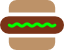
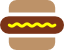
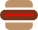

# The Frankfurter

For more information on the process of creating this icon, read our [blog post](http://www.boltmade.com/blog/process/the-frankfurter) on the [Boltmade.com](http://boltmade.com/) blog.

## Usage

You can download the SVG images and directly use them in your own site or you can refer to the main SVG directly within your source:

* [https://raw.githubusercontent.com/Boltmade/frankfurter/master/frankfurter.svg](https://raw.githubusercontent.com/Boltmade/frankfurter/master/frankfurter.svg)

## Customisation

The various path elements of the SVG are identified by ID properties so if you inline the SVG into your DOM you can style the various pieces with your CSS.

For example, you can change the ```#condiment``` group element to change the colour of the condiment strip:

  

You can use the icon as a more traditional monochromatic black or grey colour as well:

 

## Public Domain

While we've made this available for any kind of use without an attribution requirement, if you use this in a project of yours, [drop us a line](http://www.boltmade.com/#contact). We'd love to see how other people use it.

<p xmlns:dct="http://purl.org/dc/terms/" xmlns:vcard="http://www.w3.org/2001/vcard-rdf/3.0#">
  <a rel="license"
     href="http://creativecommons.org/publicdomain/zero/1.0/">
    
  </a>
  <br />
  To the extent possible under law,
  <a rel="dct:publisher"
     href="https://github.com/Boltmade/frankfurter/">
    <span property="dct:title">Boltmade Inc.</span></a>
  has waived all copyright and related or neighboring rights to
  <span property="dct:title">The Frankfurter</span>.
This work is published from:
<span property="vcard:Country" datatype="dct:ISO3166"
      content="CA" about="https://github.com/Boltmade/frankfurter/">
  Canada</span>.
</p>
